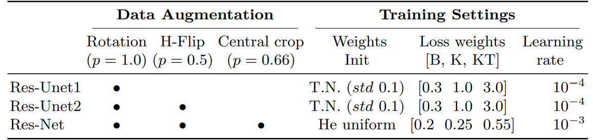
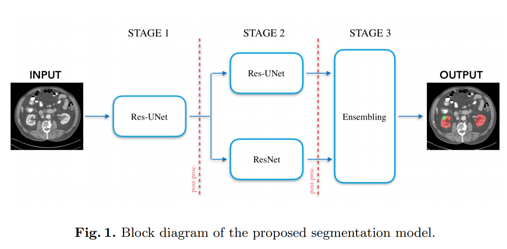
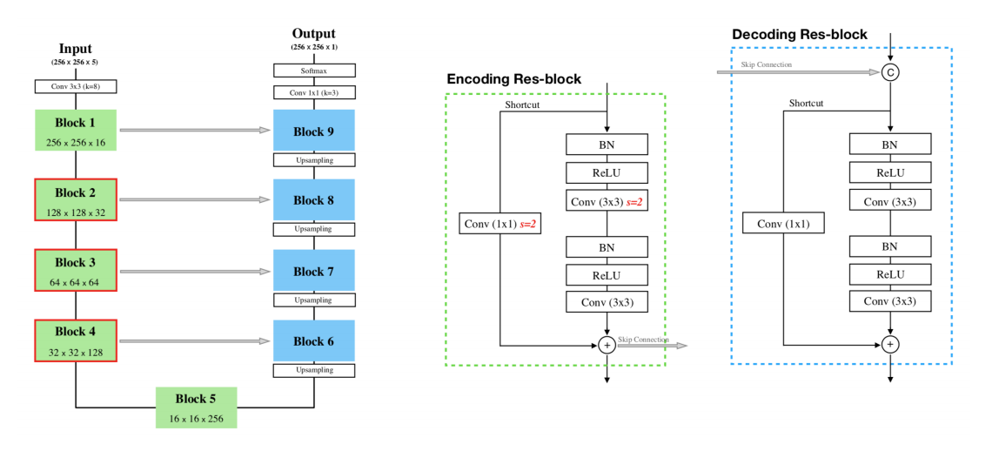
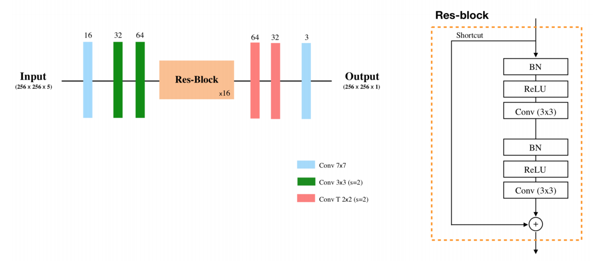

# Reproducing: Kidney tumor segmentation using an ensembling multi-stage deep learning approach. A contribution to the KiTS19 challenge
Reproducing [Kidney tumor segmentation using an ensembling multi-stage deep learning approach. A contribution to the KiTS19 challenge](https://arxiv.org/pdf/1909.00735.pdf) by Gianmarco Santini, No´emie Moreau and Mathieu Rubeaux.

## Torch/Catalyst Pipeline (Overview)
### Preprocessing
* Resampled all volumes to have a thickness of 3mm.
* Clipped to [-30, 300] HU
* z-score standardization (zero mean and unit variance)

### Training

* Paper only used a GTX 1080 (11 GB)!
* Weighted categorical cross entropy and Adam
* L2 Regularization (scale factor=0.1)
* 250 epochs were fixed as upper bound limit for training each single network
  * According to paper, all the conducted trials, the best model was always reached around
  170 ± 30 epochs.
* Batch size of 32
* Data augmentation strategies
  * axial rotation (angle ∈ [−30◦, 30◦])
  * horizontal flip
  * central crop plus zoom were also employed on-the-fly on KT cases only

#### Class Sampling
* B (background), K (kidney), KT (kidney + tumor)
* __Stage 1:__ Sampled each class with p=0.33
* __Stage 2:__ Samples only K and KT (p=0.5)

### Architectures

* The proposed model is characterized by three different stages:
  * The first stage aims to roughly segment the region of interest (ROI) where to focalize the subsequent analysis, in this case the kidney region.
  * In the second stage, the segmentation of the kidneys and cancerous tissue, is carried out by two different neural networks, which work on the image sub-portions extracted
  thanks to the use of the approximate kidney predictions from stage one.
The results are finally combined in the last stage, where the final segmentation is obtained by using an ensembling operation.

#### First Stage (Localization with Segmentations)

Segmenting kidneys with cancerous tissue & using Residual U-Net with pre-activation residual blocks.
* The residual blocks have a 1x1 convolution to make the addition part of the residual connection possible for different sizes
and channels.
* Linear activation function? Assuming this means ReLU.
* Upsampling with Transposed Convolutions with stride 2.
* Input halved to 256×256 pixels in the x-y plane.
* 2.5D approach (5 total slices, 2 top, 2 bottom) with axial slices.
  * Predicting __only on central slice__.
  * Softmax predictions (0: background, 1: kidney, 2: kidney tumor)
* Post-processing
  * Foreground classes merged after prediction.
  * The ROIs to segment for Stage 2 were extracted creating a bounding box to circumscribe the union
    of the kidney plus the tumor (or just the kidneys) by using the (x, y, z) coordinates
    from the first stage segmentations.
  * After that, the bounding box was symmetrically expanded to reach the final size of 256×256 pixels.
    * Avoids interpolation process on the extracted images.

### Stage 2

Two architectures: ResU-Net and ResNet. The ResU-Net is the same as Stage 1's architecture.
ResNet architecture is shown above.
* 2.5D inputs (same as Stage 1)
  * image sub-portions at the original full resolution along x-y and an interpolated slice thickness at 3 mm.
* Dropout is located right after each convolution (BN-ReLU-Conv-Dropout) according to the authors.

### Stage 3
Ensembles predictions with Stage 2.

### Post-Processing (General)
A simple post-processing operation was carried out at the end of both the first and second stages.
Removed 3D connected components less than or equal to 5000 pixels.


## Results


## How to Use

### Downloading the Dataset
The recommended way is to just follow the instructions on the [original kits19 Github challenge page](https://github.com/neheller/kits19), which utilizes `git lfs`.
Here is a brief run-down for Google Colaboratory:
```
! sudo add-apt-repository ppa:git-core/ppa
! curl -s https://packagecloud.io/install/repositories/github/git-lfs/script.deb.sh | sudo bash
! sudo apt-get install git-lfs
! git lfs install
% cd "/content/"
! rm -r kits19
! git clone https://github.com/neheller/kits19.git
# takes roughly 11 minutes to download
```

### Preprocessing
To do general preprocessing (resampling):
```
# preprocessing
from kits19cnn.io.preprocess import Preprocessor
base_dir = "/content/kits19/data"
out_dir = "/content/kits_preprocessed"

preprocess = Preprocessor(base_dir, out_dir)
preprocess.cases = sorted(preprocess.cases)[:210]
%time preprocess.gen_data()
```
Note that the standardization and clipping is done on-the-fly.

If you want to do __2D segmentation__:
```
# preprocessing
from kits19cnn.io.preprocess import Preprocessor
out_dir = "/content/kits_preprocessed"

preprocess = Preprocessor(out_dir, out_dir, with_mask=True)
preprocess.cases = sorted(preprocess.cases)[:210]
preprocess.save_dir_as_2d()
```
If you want to do __binary 2D segmentation__ (kidney only or renal tumor only).
```
import os
from kits19cnn.experiments.utils import parse_fg_slice_dict_single_class
preprocessed_dir = "/content/kits_preprocessed"

json_path = os.path.join(preprocessed_dir, "slice_indices.json")
out_path = os.path.join(preprocessed_dir, "slice_indices_tu_only.json")

_ = parse_fg_slice_dict_single_class(json_path, out_path, removed_fg_idx="1")
out_path = os.path.join(preprocessed_dir, "slice_indices_kidney_only.json")
_ = parse_fg_slice_dict_single_class(json_path, out_path, removed_fg_idx="2")
```

### Training
Please see the example yaml file at `script_configs/train.yml`. Works for 2D, 2.5D,
and 3D. Also, supports binary 2D segmentation if you change the `slice_indices_path`.
Also, supports classification + segmentation for nnU-Net (doesn't work that well).
```
python /content/kits19-cnn/scripts/train_yaml.py --yml_path="/content/kits19-cnn/script_configs/train.yml"
```
__TensorBoard__: Catalyst automatically supports tensorboard logging, so just run this in Colaboratory:
```
# Load the TensorBoard notebook extension
%load_ext tensorboard
# Run this before training
%tensorboard --logdir logs
```
__For Plotting Support (plotly/orca) [OPTIONAL]:__
The regular training script (`script_configs/train.yml`) doesn't plot the graphs
directly, but saves them as .png files. If you don't want to do all of this installing, just exclude `plot_params` in `scripts/train_yaml.py`
```
# on colab

# installing anaconda and plotly with orca + dependencies
!wget https://repo.anaconda.com/miniconda/Miniconda3-latest-Linux-x86_64.sh
!chmod +x Miniconda3-latest-Linux-x86_64.sh
!bash ./Miniconda3-latest-Linux-x86_64.sh -b -f -p /usr/local
# !conda install -c plotly plotly-orca
!conda install -c plotly plotly-orca psutil requests ipykernel
!export PYTHONPATH="${PYTHONPATH}:/usr/local/lib/python3.7/site-packages/"
!pip install nbformat

# orca with xvfb support (so orca can save the graphs)
# Plotly depedencies
!apt-get install -y --no-install-recommends \
        wget \
        xvfb \
        libgtk2.0-0 \
        libxtst6 \
        libxss1 \
        libgconf-2-4 \
        libnss3 \
        libasound2 && \
mkdir -p /home/orca && \
cd /home/orca && \
wget https://github.com/plotly/orca/releases/download/v1.2.1/orca-1.2.1-x86_64.AppImage && \
chmod +x orca-1.2.1-x86_64.AppImage && \
./orca-1.2.1-x86_64.AppImage --appimage-extract && \
printf '#!/bin/bash \nxvfb-run --auto-servernum --server-args "-screen 0 640x480x24" /home/orca/squashfs-root/app/orca "$@"' > /usr/bin/orca && \
chmod +x /usr/bin/orca

# enabling xvfb
import plotly.io as pio
pio.orca.config.use_xvfb = True
pio.orca.config.save()
```

### Inference
Please see the example yaml file at `script_configs/pred.yml`. There's a tumor-only
example in `script_configs/infer_tu_only/pred.yml`.
```
# kidney-tumor
python /content/kits19-cnn/scripts/predict.py --yml_path="/content/kits19-cnn/script_configs/pred.yml"
# tumor only
python /content/kits19-cnn/scripts/predict.py --yml_path="/content/kits19-cnn/script_configs/infer_tu_only/pred.yml"
```

### Evaluation
Please see the example yaml file at `script_configs/eval.yml`. There's a tumor-only
example in `script_configs/infer_tu_only/eval.yml`.
```
# kidney-tumor
python /content/kits19-cnn/scripts/evaluate.py --yml_path="/content/kits19-cnn/script_configs/eval.yml"
# tumor only
python /content/kits19-cnn/scripts/evaluate.py --yml_path="/content/kits19-cnn/script_configs/infer_tu_only/eval.yml"
```

### Submission
Currently, only on the `preprocess-test-set` branch.
